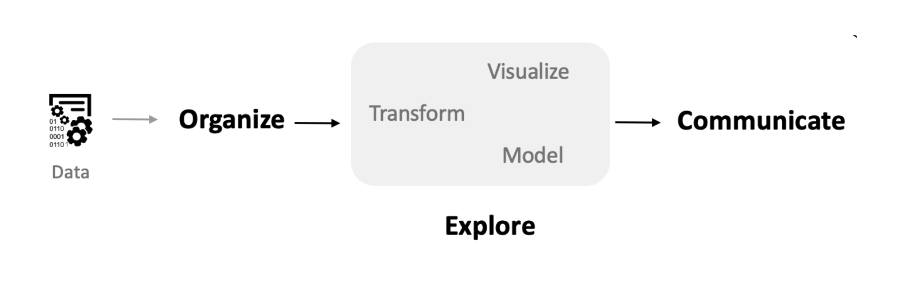
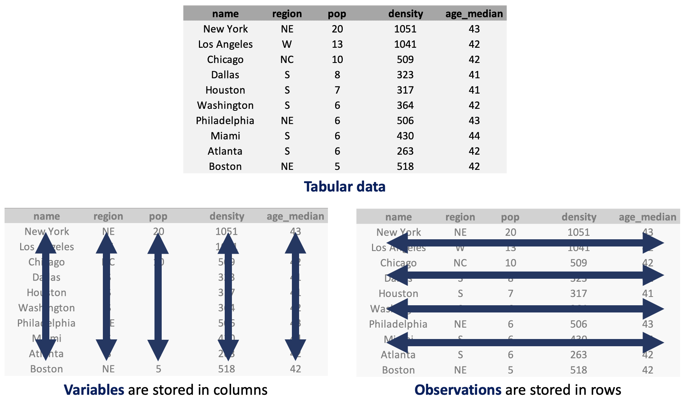

# Introduction {#sec-intro}

```{python}
#| include: false
```

## Introduction

In this book, we focus on tools and techniques for exploratory data analysis, also known as EDA. Initially described in John Tukey's classic text of the same name, EDA is a general approach to examining data through visualizations and broad summary statistics [@ch1:tukey1977exploratory] [@brillinger2002john]. It prioritizes studying data directly to generate hypotheses and ascertain general trends prior to and often in lieu of formal statistical modeling. The growth in both data volume and complexity has further increased the need for careful application of these exploratory techniques. In the intervening years, EDA techniques have become widely used within statistics, computer science, and many other data-driven fields and professions.

{#fig-eda .lightbox}

The histories of data programming and EDA are deeply entwined. Concurrent with Tukey's development of exploratory data analysis (EDA), Rick Becker, John Chambers, and Allan Wilks of Bell Labs began developing software designed specifically for statistical computing. By 1980, the 'S' language was released for general distribution outside Bell Labs. It was followed by a popular series of books and updates, including 'New S' and 'S-Plus' [@ch1:becker1984s] [@ch1:becker1985extending] [@ch1:becker1988new] [@ch1:chambers1991statistical]. In the early 1990s, Ross Ihaka and Robert Gentleman produced a fully open-source implementation of S called 'R'. The name 'R' was chosen both as a play on the previous letter in the alphabet and as a reference to the authors' shared initial. Their implementation has become the de facto standard tool in statistics. More recently, many of R's best ideas have been extended to other general-purpose programming languages such as Python and JavaScript.

## Data Science Ecosystem

The ideas and methods of exploratory data analysis (EDA) have been successfully adopted and extended in Python through a rich ecosystem of data science libraries. Python, originally created by Guido van Rossum in 1991, has evolved into one of the most popular programming languages for data analysis, machine learning, and scientific computing. Pandas, developed by Wes McKinney beginning in 2008, brought R-like data structures and manipulation capabilities to Python [@mckinney2022python]. Matplotlib and, later, Seaborn provided comprehensive plotting capabilities, while plotnine implemented the grammar of graphics approach pioneered by ggplot2 in R. More recently, Polars has emerged as a high-performance alternative to pandas for large-scale data manipulation.

This Python ecosystem preserves the philosophy behind EDA: prioritizing interactive exploration, readable code, and the ability to move seamlessly between data manipulation, visualization, and analysis. We see this book as contributing to efforts to bring new communities into data analysis and to help shape that analysis by offering the humanities and humanistic social sciences powerful tools for data-driven inquiry. A visual summary of the steps of EDA is shown above in @fig-eda. We will see that the core chapters in this text map onto the steps outlined in the diagram.

## Setup

While it is possible to read this book as a conceptual text, we expect that the majority of readers will eventually want to follow along with the code and examples given throughout the text. The first step is to obtain a working installation of Python with the necessary data science modules. For readers new to programming, we recommend getting started with Google Colab, which provides free access to a working Python session with no setup required. For users comfortable with the command line, the [uv](https://docs.astral.sh/uv/) command-line tool is extremely powerful and reduces many of the pain points associated with other methods of setting up Python.

In addition to the Python software, following the examples in this text requires access to the datasets we use. Care has been taken to ensure that these are all in the public domain, making them easy to redistribute to readers. The materials and download instructions are available through the associated notebooks at the start of each chapter.

Learning to program is hard, and questions and issues will invariably arise in the process (even the most experienced users require help surprisingly frequently). As a first source of help, searching a question or error message in a search engine or a chat-based generative AI system will often pull up a solution directly related to your question. If you cannot find an immediate answer, the next best step is to find local, in-person help. While we've done our best in this static text to explain the concepts for working with Python, nothing beats talking to a real person.

## Working with Notebooks

The supplemental materials include all the data and code needed to replicate the analyses and visualizations in the book. We include the exact code that is printed in the book. We have used Quarto notebooks (with an `.qmd` extension) to store this code, with a file corresponding to each chapter. Quarto notebooks are an excellent choice for data analysis because they allow us to mix code, visualizations, and explanations within the same file. In fact, the entire data science workflow—from initial exploration through final presentation—can be contained within a single notebook. The notebooks can be run locally or in a cloud environment such as Google Colab.

The Quarto environment provides a convenient way to view and edit notebooks. A notebook interface is organized into cells that contain either code or formatted text (markdown). Running a code cell executes the Python code and displays the output directly below the cell, making the environment ideal for exploratory data analysis because we can experiment and immediately see the results. Code cells typically have a gray background and can be executed by clicking the run button or pressing `Shift+Enter`. When we read or create a dataset, we can inspect it by typing the variable name in a cell.

## Running Python Code

Now let's look at some examples of how to run Python code. In this book, we will show snippets of Python code and their output. Note that each snippet should be thought of as occurring in a code cell in a Quarto notebook. In one of its simplest forms, Python acts as a calculator. We can add 1 and 1 by typing `1 + 1` into a code cell; running the cell will display the output (`2`) below. In this book, we will present code and its output in a black box, with the Python code shown inside it and any output shown beneath. An example is given below.

```{python}
1 + 1
```

In addition to returning a value, running Python code can also store values by creating new variables. Variables in Python are used to store anything—such as numbers, datasets, functions, or models—that we want to use again later. Each variable has a name we can use to access it in later code. To create a variable, we use the `=` (equals) symbol, with the name on the left and the expression that produces the value on the right. For example, we can create a new variable called `mynum` with the value `8` by running the following code.

```{python}
mynum = 3 + 5
```

Notice that this code did not print any results because the result was saved to a new variable. We can now use our variable `mynum` in the same way we would use the number 8. For example, adding it to 1 yields the number nine:

```{python}
mynum + 1
```

Variable names must start with a letter or an underscore, but can contain numbers after the first character. We recommend using only lowercase letters and underscores. This makes it easier to read the code later without having to remember whether and where you used capital letters.

## Functions in Python

A function in Python takes a set of input values and returns an output value. Typically, a function has a format similar to the code below:

```{python}
#| eval: false
function_name(input1, input2)
```

Where `input1` and `input2` are the values we pass to the first and second arguments of the function. The number of arguments is not always two, of course. There may be any number of arguments, including zero. There may also be additional optional arguments with default values that can be modified. Let us look at an example function: `round`. This function returns a rounded version of a number. If you give the function a single number, it returns the nearest integer. For example, here is the rounded value of π:

```{python}
round(3.14159)
```

The function has an additional optional parameter that specifies the number of decimal places. For example, this will round π to two decimal places:

```{python}
round(3.14159, 2)
```

An alternative way to call the same function is to use *named arguments*, where the two input values are specified by name rather than by position:

```{python}
round(number=3.14159, ndigits=2)
```

How do we know the inputs to each function and what they do? In this text, we will explain the names and usage of the required inputs for new functions as they are introduced. To learn more about all of the possible inputs to a function, we can consult the function's documentation. Python has excellent built-in documentation that can be accessed using the `help()` function. Most Python modules also have extensive online documentation. For example, the Polars library has comprehensive documentation at [https://pola.rs/](https://pola.rs/). We will learn how to use numerous functions in the coming chapters, each of which will help us explore and understand data.

## Data Science Modules

A major selling point of Python is its extensive collection of user-contributed modules, available through the Python Package Index (PyPI). Most of the core modules we will need are already installed in Google Colab, and all we need to do is import them. When extra modules are needed, we will include lines of code such as the following to install them from within the Colab environment.

```{python}
#| eval: false
! pip install requests --quiet
```

Once all modules are available, we'll run code to load the modules we need into Python. Below is a common example of what we'll have at the start of our scripts.

```{python}
import polars as pl
from plotnine import ggplot, aes
from polars import col as c

import funs
```

The lines that start with `import` make a module available for use in Python. Any function available within the module can be accessed by writing the module name followed by a dot and the function name. The `as` clause creates a shortcut that makes the code easier to type. For example, after running the code above, we can call the `read_csv` function from Polars by typing `pl.read_csv`. Code that starts with `from` imports specific functions from the given libraries, making them available without needing to prefix them with the library name. The second-to-last line imports the `col` function from Polars and aliases it as `c`. We will use this function extensively throughout the book; the shorthand will greatly reduce clutter in our code. The final line loads all of the custom functions in a local file called `funs.py`. These are wrapper functions we have created to help simplify the code in this text. Each wrapper will be explained as it arises and can be directly inspected by opening the Python script directly. Other modules, such as NumPy, will be imported in later chapters as soon as we need them.

## Loading Data in Python

In this book, we will be primarily working with data stored in a tabular format. @fig-img-tidy shows a small tidy dataset of large US cities. The figure shows structures organized by rows and columns. Each row of the dataset represents a particular city; we call each row an *observation*. The columns represent the measurements we record for each observation; these measurements are called *variables*.

{#fig-img-tidy .lightbox}

The dataset shown in the figure includes five of these variables: the city's name, the region of the country in which it is located, its population (in millions), its population density (in people per square kilometer), and the median age of its residents. The `country` dataset that we will use as a running example throughout this chapter has the same structure, with each row an observation and each column a variable; more details are given in the following section.

A common format for storing tabular datasets is the plaintext comma-separated values (CSV) file. Almost all of the datasets in this book will use this format for storing the data that we will work with. To read a dataset into Python, we use the function `pl.read_csv()` from the Polars library. We call `pl.read_csv()` with the path to the file relative to the current working directory. Below is an example of how to read the dataset contained in the file "data/countries.csv" and save it as an object called `country`. The resulting dataset is stored as a Python object called a *DataFrame*.

```{python}
country = pl.read_csv("data/countries.csv")
country
```

Notice that the display shows a total of 135 rows and 15 columns. Or, with our terms defined above, there are 135 observations and 15 variables. Only the first five and last five observations are shown in the output, along with information about the shape of the DataFrame.

The data types shown by Polars, such as `str`, `i64`, and `f64`, tell us the type of data stored in each column. We will not need them right away, but they matter enough that we devote @sec-types to them once we have some experience working with data.

## Formatting Code

It is important to format Python code consistently. Even if code runs without errors and produces the desired results, consistent formatting makes it easier to read, debug, and maintain. Throughout this book, we will follow the conventions below, based on PEP 8 (Python's official style guide). These are the same conventions used by professional data scientists and software developers. Adopt these rules whenever you write code for this course.

1. Use one space before and after the equals sign `=` and around binary operators (such as `+`, `-`, `*`, `/`, `%`, `<`, `>`, `==`).
2. Exception: do not use spaces around the equals sign when specifying function arguments or keyword arguments (for example, `def f(x=5):` or `geom_text(size=6)`). We make one further exception to this rule: when a keyword argument names a new column, as in `.with_columns(population_1k = c.pop * 1000)`, we do put spaces around the `=` so that the new column name stands out; ordinary options such as `descending=True` get no spaces.
3. Use one space after a comma, but no space before it.
4. Use lowercase letters with underscores for variable and function names (snake_case).
5. Use double quotes for strings (for example, `"hello"` rather than `'hello'`).
6. Keep lines reasonably short; if a line becomes too long (typically over 79–88 characters), split it across multiple lines.
7. When breaking code across multiple lines:
   - Wrap the expression in parentheses
   - Indent continuation lines by 4 spaces
   - Put each logical step (method call, operator) on its own line
   - For operator chaining, place the operator at the start of the continuation line
   - Align the closing parenthesis with the start of the expression
8. Avoid trailing whitespace and keep indentation consistent throughout the file.

The following example applies these formatting rules in practice. Do not worry if you have not yet seen these specific functions or libraries; we will cover them later in the course. For now, focus on the structure and layout of the code.

```{python}
#| eval: false
(
    country
    .filter(c.region == "Europe")
    .pipe(ggplot, aes(c.hdi, c.happy))
    .geom_point()
    .geom_text(aes(label=c.iso), size=6, nudge_y=0.5)
)
```

Notice how spacing, indentation, and line breaks work together to make the logic clear and readable. Following these conventions from the start will make your work easier to read, debug, and maintain. 

## Extensions

Each chapter in this book contains a short concluding section with extensions to the main material. These include references for further study, additional Python libraries, and other suggested methods that may be of interest for the study of each specific type of humanities data.

In this chapter, we mention a few standard Python references that may be useful to consult alongside our text. The classic introduction to the Python language is *Learning Python* by Mark Lutz [@lutz2013learning]. For those specifically interested in data science applications, *Python for Data Analysis* by Wes McKinney (the creator of pandas) provides comprehensive coverage of the core data science libraries [@mckinney2022python].

For the specific approach to data analysis we follow in this book, *Python Data Science Handbook* by Jake VanderPlas is an excellent reference [@vanderplas2016python]. It covers the full stack of data science tools in Python, from basic data manipulation through machine learning. The book is also freely available online.

For those interested in the grammar of graphics approach to visualization that we use throughout this book, *The Grammar of Graphics* by Leland Wilkinson provides the theoretical foundation [@wilkinson2012grammar]. The plotnine module implements these concepts in Python, closely following the ggplot2 implementation in R.

## References {-}
