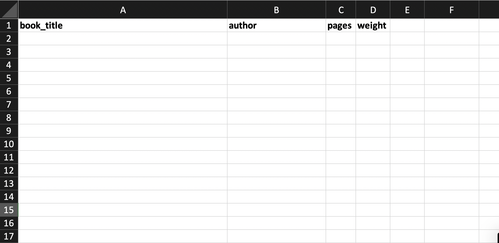
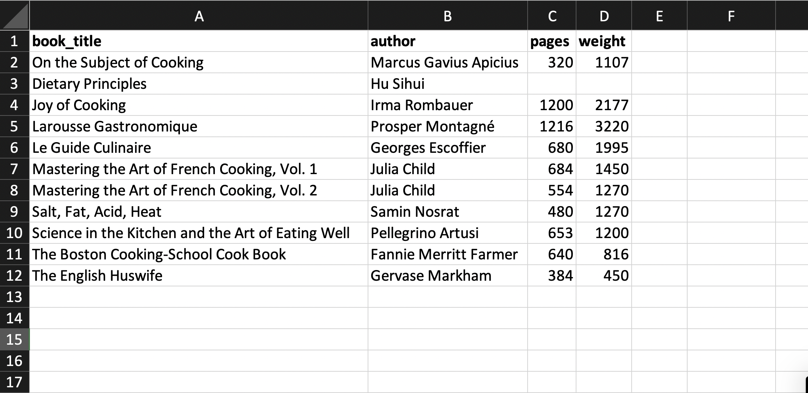
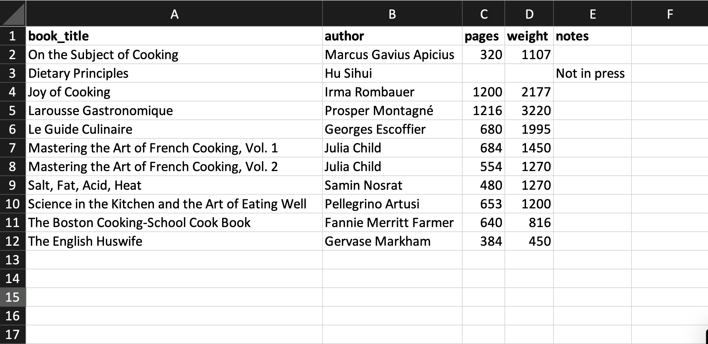
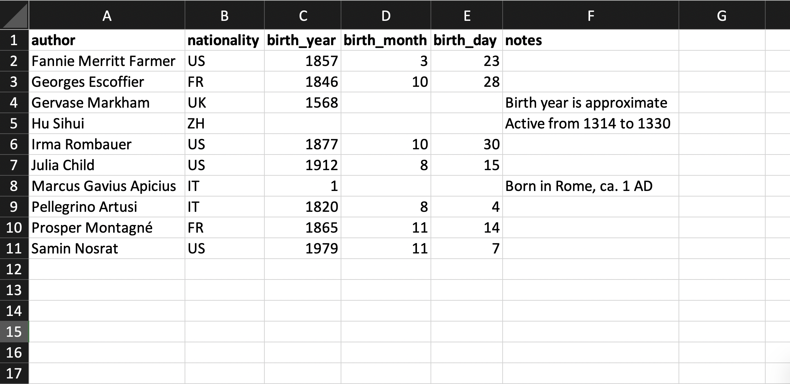
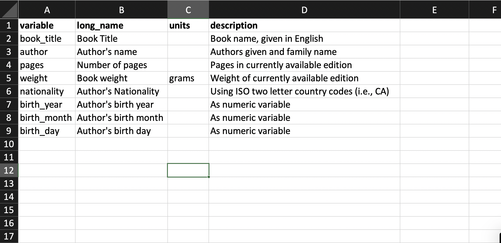

# Collecting Data {#sec-collect}

```{python}
#| include: false
import warnings
warnings.filterwarnings("ignore")
```

## Introduction

It's commonly said in data science that most of our time is spent collecting and cleaning data. If we collect data in a clean format from the start, we can proceed directly to the exploration stage. Chapter 9 laid out the theory behind that claim: what makes a table tidy, and why. This chapter is about practice. Rather than the framework itself, it covers the decisions you actually face when building a dataset from scratch.

Two sources are worth reading in full. Karl Broman and Kara Woo's "Data Organization in Spreadsheets" mixes practical advice with a discussion of the principles behind it [@ch02:broman2018data]. Catherine D'Ignazio and Lauren Klein's *Data Feminism* raises questions of bias, inequality, and power that come up constantly when collecting and organizing data, even in projects that look purely technical [@klein2020feminism].

This chapter gives a concise set of recommendations for organizing and storing data, rather than an extended discussion of alternatives. For the alternatives, see the sources above. Because it doesn't rely on advanced spreadsheet functions, any spreadsheet program will work. The screenshots come from Microsoft Excel, but the same steps apply in Google Sheets, LibreOffice, and similar programs.

## What Tables?

The initial step in designing storage for tabular data is deciding what different tables we will need. As we saw in Chapter 9 when discussing pivots and unpivots, the most important characteristic that determines the structure of a specific table is the unit of observation. Recall that the unit of observation can be a simple value (such as `day` or `plant`) or a combination of values (such as `day × plant`). So, we need to decide which simple and complex units of observation we need for our specific application. There are two general principles that we should keep in mind in this process:

- **prefer longer to wider**: When we have a situation where we need to decide between a longer and a wider format, prefer the longer format. It is easier to extend, easier to check, and there is usually only one long format instead of multiple possible wide ones.
- **respect unit of observation**: When filling in data in a table, a general rule is that we only record data that describes the entire unit of observation. This is always the case for a simple unit of observation, but can easily be broken when we have a complex key. 

The second principle means that if we have a table for `day × plant` and need to store metadata about each plant, we should create a second table whose unit of observation is `plant`. This avoids copying data each time we observe a plant and prevents data inconsistencies. If we need all the data together for our analysis, it is better to merge the tables once we have collected all the data.

## What Variables?

The second step, after we have the units of observation associated with each table, is to decide which columns each table will contain. As discussed, selecting the columns is straightforward once we know which variables our analysis requires. It's a good idea to include one or more columns that serve as a primary key when a natural primary key already exists in your dataset.

In addition to choosing what to put in each column, we also need to decide how the data in a column will be formatted. Again, we have a few general rules we can apply to help with this:

- **prefer numeric**: If a variable can be stored as a number we should do so. Put other information (such as units of measurement or currency type) in another variable if needed. As much as possible, use a standard unit of measurement for a variable.
- **use standards**: When we have character variables, the best option is to use an externally standardized format (such as USPS state codes or ISO country codes). When these do not exist, create and document your own standards as carefully as possible.
- **atomic cells**: Only put a single thing in each variable value. Avoid, for example, putting in multiple values separated by commas. If you will ever use only part of the variable (say, the area code of a phone number) put it in a separate column.

We will return to ways to document these decisions in a data dictionary later in the chapter.

## What Variable Names?

The final decision we need to make regarding how to store our data is the names we'll use for the variables. As we've seen, variable names in a dataset are used to describe graphics in the grammar of graphics and to manipulate data with Polars. If names are too long or complex, creating data visualizations becomes more difficult. Conversely, names that are too short and cryptic make it hard to recall their meaning. When variable names contain spaces or other special characters, it can be nearly impossible to work in Python without first cleaning them up after loading the data.

Here are two general rules for naming columns that we should try to follow in our work:

- **allowed characters**: Use only lower-case letters, numbers, and underscores. The underscores can be used to represent a space between words. Also, always make sure to start the name of a variable with a lower-case letter and not a number or underscore.
- **simple names**: Do not include extra metadata in the column names, such as units, unless they are needed to distinguish two columns. Prefer short but full names to complex abbreviations.

Note that these guidelines apply only to variable names. We can and should use spaces and capital letters in actual values where appropriate.

## Storing Data in Spreadsheets

Now that we have an idea of the main decisions about how to organize our data, which we will call the *data schema*, we will turn to the task of actually collecting our data in a spreadsheet program. As with the other sections, we can summarize the best practices with the following guidelines:

- **A1**: Always start your data collection in the A1 cell. That is, in the upper-left corner of the spreadsheet. The first row contains the column names. The other rows contain our data.
- **sheets as tables**: Each table should be a separate sheet. Name the sheets with the names you expect to call the data as Python objects.
- **just tables**: Do not include any additional information in the sheet outside of the tabular format. If you need notes, include them as an extra column or extra table.
- **minimal formatting**: Some minimal formatting that helps you enter the data can be helpful. For example, making the first row bold, sizing the column widths, using conditional formatting to highlight data errors. However, you should never use formatting to hold any actual data. Use extra columns if you need them.

Most sources on collecting data suggest saving the results from our spreadsheets in a plain-text format. This is a stripped-down representation of the data that contains no formatting information and is application-agnostic. Excel, Google Sheets, LibreOffice, and any other spreadsheet program should be able to save a dataset in a plain-text format. The most commonly used format for tabular data in data science is the comma-separated values (CSV) file. In a CSV, columns are separated by commas and each row is on its own line. The CSV format stores only a single table and therefore is not ideal for storing multiple tables at once.

Our recommendation is a bit less strict about the need to export data only as a plain-text file. Plain text is the best way to share and store a dataset once an analysis is finished, but if we will continue adding to and changing the dataset, it may be preferable to store the data as an Excel file (`.xlsx`) or in Google Sheets. The latter (Google Sheets) can also be read directly into Python. This also avoids errors introduced when converting back and forth between Excel and plain-text formats. Data can be loaded directly from an Excel file as well using `pl.read_excel()`. Once the data collection and cleaning are finished, it's a good idea to store the data in a plain-text format for sharing and long-term preservation.

## Reading Imperfect Files

Everything so far in this chapter describes how to store data well when you are the one collecting it. Most of the time, you are not. A collaborator hands you a spreadsheet with three header rows and a merged cell. A government agency publishes a CSV encoded in Windows-1252 because the export tool was built in 2003 and never updated. A survey platform codes missing responses as `"-99"` instead of leaving the cell blank. None of this data is unusable, but none of it will load cleanly with the default settings either. This section covers the tools for reading it anyway.

Loading a well-formed Excel file is simple. As mentioned above, `pl.read_excel()` reads a sheet directly into a Polars data frame:

```{python}
#| eval: false
import polars as pl

cookbooks = pl.read_excel("data/cookbooks.xlsx", sheet_name="Cookbooks")
```

If the file has multiple sheets and you don't specify `sheet_name`, Polars reads only the first sheet; passing `sheet_id=0` instead returns a dictionary mapping sheet names to data frames, which is convenient when a workbook holds several related tables at once, such as the cookbooks and authors tables from the worked example below.

CSV files are just as common and, because they carry no information about types or encoding, tend to break in more varied ways. The function `pl.read_csv()` has a long list of arguments to handle this. In practice, a handful come up over and over:

- **`separator`**: CSV technically stands for comma-separated values, but plenty of files use a semicolon, a tab, or a pipe instead, often because they were exported from a system configured for a locale where the comma is a decimal separator. Set `separator=";"` (or whatever character the file actually uses) to fix this.
- **`encoding`**: Polars assumes UTF-8 by default. Older files, or files exported from Windows programs, are often encoded as `"windows-1252"` or `"latin1"` instead. Reading a file with the wrong encoding usually produces garbled characters rather than an outright error, so this one is easy to miss until you spot a name like "José" where "José" should be.
- **`skip_rows`**: Some export tools add a title, a generation date, or a logo caption above the actual header row. Setting `skip_rows` to the number of lines to discard gets you to the real start of the table.
- **`null_values`**: Missing data is not always blank. Surveys and legacy databases frequently use a placeholder such as `"NA"`, `"N/A"`, `"-99"`, or `"."`. Passing a list of these strings to `null_values` tells Polars to treat them as missing rather than as literal text or, worse, as numbers.
- **`schema_overrides`**: Polars guesses each column's type from its contents, and the guess is sometimes wrong in a way that loses information. A ZIP code column full of five-digit numbers gets read as an integer, which silently drops the leading zero from "02138." Passing `schema_overrides={"zip_code": pl.Utf8}` forces that column to stay text.

Putting several of these together on a single file is normal, not exceptional:

```{python}
#| eval: false
survey = pl.read_csv(
    "data/survey_responses.csv",
    separator=";",
    encoding="windows-1252",
    skip_rows=2,
    null_values=["NA", "N/A", "-99"],
    schema_overrides={"zip_code": pl.Utf8, "respondent_id": pl.Utf8},
)
```

The messy CSV file from @sec-types is a good one to revisit here. It is not a contrived example; it is closer to what you should expect from real, second-hand data than the clean files we have been using for most of this book. Fixing it draws on the same skills built up across the last several chapters: recognizing the unit of observation to know which rows belong together, reshaping the result into a tidy layout once it loads, and checking the loaded data frame against the grammar-of-graphics tools from earlier chapters to confirm that a column of what looked like numbers didn't quietly load as text. Reading an imperfect file is rarely a single function call. It's a short investigation, and everything else in this book is what you investigate with.

## Data Dictionary

Finally, it is important to document exactly what information is being stored in each table and its variables. It is also important to note any relationships between primary and foreign keys, especially when they have different names. To do this, we can construct a *data dictionary*. Ideally, this will explain, for each variable, basic information such as the variable's name, measurement units, and expected values or categories. Any decisions that needed to be made should also be documented. A data dictionary can be a simple text file, or it can be stored as a structured dataset. Often, when storing data in a spreadsheet program, the data dictionary is included as the first or last sheet.

## Special Considerations

The guidelines above summarize the primary issues to consider when designing dataset formats. Here are some additional considerations that arise from time to time:

- **dates**: Dates and times can be particularly error-prone when building datasets. There are two general approaches that we recommend. Either record each element (year, month, day, hour, and so forth) as separate columns or use the formats `YYYY-MM-DD` and `YYYY-MM-DD HH:MM:SS`, based on the ISO 8601 standard from the International Organization for Standardization (the standard itself uses a `T` in place of the space).
- **missing values**: Always use a blank entry to represent a missing value in a numeric column. This is a good approach for character variables as well, but it is also possible to record one or more special missing value codes depending on your use-case.
- **text and multimedia**: When studying large collections of text, images, video, and other multimedia formats, often our tabular dataset contains just metadata about the records. The multimedia files (such as `.mp3`, `.mp4` or `.png`) also contain what we should consider to be data. To incorporate these, include the file name (and full path if they are not all in the same directory) as a column in one of the datasets. 
- **synthetic keys**: Sometimes we need a primary key in a table even though a good natural key does not exist. We also may want to replace a key with multiple columns with a single key. To do this, we can use an algorithm to fill in unique ids, such as a UUID.

We will see examples of all of these either in the example below or in other chapters of this text.

## Worked Example

We will now walk through an example of how to put these steps into action by storing information about a set of cookbooks and their authors. We'll create two tables for this: one with the unit of observation `cookbooks` and the other `authors`. Here is what the cookbook table might look like before any data are entered:

{#fig-exceltwo .lightbox}

Then we can fill in the values for the table:

{#fig-excelthree .lightbox}

If we need to include explanatory notes for some data, we avoid abandoning the rectangular data format; instead, we add an extra notes column. For example, we note that one book is out of print in the notes column shown below. In the example table, the number of pages and the weight of that book are missing because it is out of print. To indicate this, the corresponding cells are left blank. Blank values are the only cross-software way to represent missing values consistently.

{#fig-excelfour .lightbox}

Now let's consider the dataset of cookbook authors. Below is an example of what the table might look like. Note that the authors table's primary key is referenced by the cookbooks table.

{#fig-excelfive .lightbox}

Finally, here is an example of a data dictionary we could use to describe the dataset:

{#fig-excelsix .lightbox}

Above, we described the data dictionary as a tabular dataset. It is also possible to present it in a less structured way, depending on how much information is required.

## Extensions

We have provided a consolidation of the information from the research papers mentioned in the introduction, focusing on issues of particular concern for humanities data collection. The first places to look for more information are the papers mentioned above: Karl Broman and Kara Woo's "Data Organization in Spreadsheets" [@ch02:broman2018data] and Catherine D'Ignazio and Lauren Klein's *Data Feminism* [@klein2020feminism]. Hadley Wickham's "Tidy Data," discussed in Chapter 9, is also worth a second look here, since its theoretical framework underlies much of the practical advice above [@ch02:hadley2014tidy]. Another source for thinking about data dictionaries, data documentation, and data publishing is the "Datasheets for Datasets" paper [@gebru2021datasheets]. While the paper focuses on predictive modeling, it offers useful examples of the documentation needed when publishing large datasets and provides a critical lens on how choices made during data collection fundamentally affect subsequent data analyses.

The kinds of data that need to be collected and how to collect them ultimately depend on one's underlying research questions. The process of translating a research question into a quantitative framework is outside the scope of this text, but it is an important consideration when working with data to address research questions in the humanities. There are many good guides to research design, though the majority focus on either scientific, hypothesis-driven quantitative designs or purely qualitative data collection. We recommend a few sources that sit at the intersection of these approaches.

Content analysis is a common social-science technique used across fields. It often mixes qualitative questions with quantitative data, making it a good source of research-design advice for humanities data analysis [@schreier2012qualitative] [@neuendorf2017content] [@krippendorff2018content]. Similarly, corpus linguistics sits at the boundary of the humanities and the social sciences and offers many resources on best practices [@paquot2021practical]. Corpus linguistics often works with both textual and audio data and has developed specific techniques for working with the rich, multimodal datasets considered in the following chapters. Finally, sociology is another field that mixes humanistic questions with quantitative data, providing additional references on research design [@bernard2017research]. Although these references include domain-specific elements, many general principles can be extended to other domains.

Finally, notice that we did not start the book with data collection, even though collecting data is most often the first step in data analysis. We saved this until the last core chapter because understanding how to collect and store data often goes hand in hand with understanding how to visualize, organize, and restructure it. A deeper understanding of how to collect data—particularly data with complex components such as text, networks, and images—will develop as we work through the remaining chapters.

## References {-}
